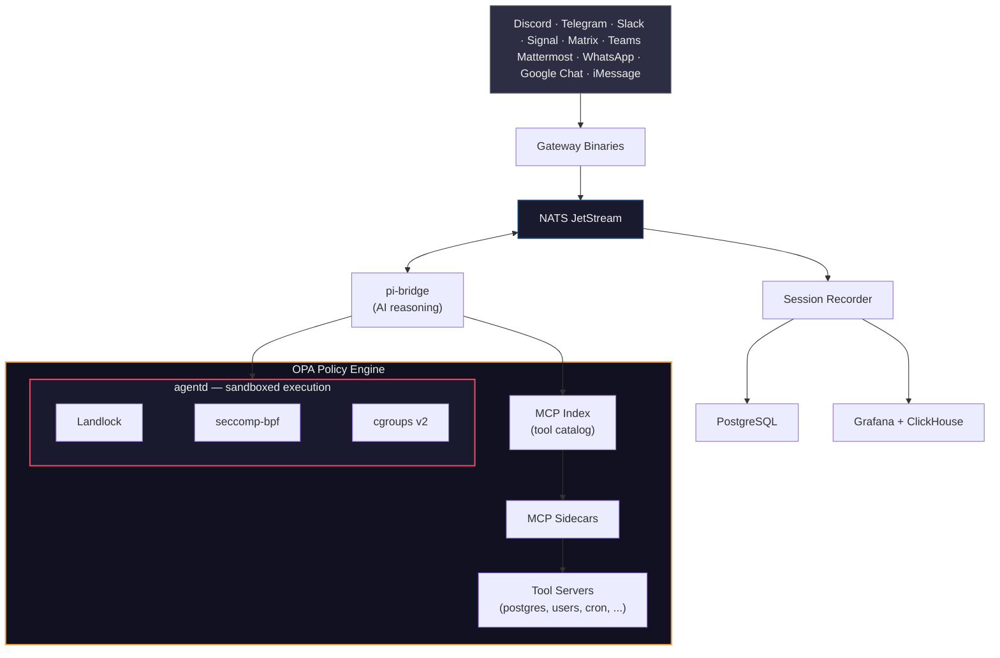

# Smith

**Your Secure Personal Assistant.**

Are you interested in automating the tedium in your life, but unsure how to do it securely? If so, Smith is for you.

Smith is a personal AI assistant that interacts with you across the chat platforms you already use, backed by sandboxed execution, policy-based admission control and an mTLS gateway. Everything the agent does is fully observable and auditable.

## Why Smith

With current agents, you're forced to choose between giving your agent capabilities and keeping yourself secure. The common refrain is that this is an unavoidable tradeoff. I beg to differ.

With existing agents, all an attacker has to do to compromise one is get it to read a prompt injection on the public web, in an email or a support ticket. Exploits exist for all frontier models, and once the model has been injected, attackers can trick your agent into installing malware in your system or exfiltrating valuable data. This isn't something you can easily mitigate with a patch, your agent needs to be architected from the ground up with security in mind.

Beyond that, existing agents are designed for tinkerers to run on throwaway systems. They're not architected to easily integrate into the control and monitoring systems that security conscious people are already using. That means more to build, configure and test. Even worse, vendors are using security configuration/management as a form of lock-in; if you're using agents from Anthropic and you want to switch to OpenAI, Anthropic will the switchover as painful as possible to dissuade you from jumping ship.

I built Smith to solve these problems. Smith was designed from the ground up with an isolated zero trust architecture suitable for deployment in regulated industries. Smith integrates with commonly adopted observability (Open Telemetry) and policy (OPA) tools out of the box, and it's been written to be easily adapted to other common stacks.

## Install

Requires **Node >= 22** and **Docker**.

```bash
npx @sibyllinesoft/smith install
npx @sibyllinesoft/smith install --harness codex
```

The installer is an AI-guided setup agent. It detects your system, walks you through configuration, and gets the stack running. For headless/CI environments:

```bash
npx @sibyllinesoft/smith install --non-interactive
```

The installer emits non-blocking security warnings if it detects weak default
secrets or missing private-network hints (for example Cloudflare Tunnel or
Tailscale configuration).
On macOS, the installer also writes Gondolin VM defaults into `.env` so
persistent sandbox sessions are enabled out of the box.
Interactive installs can use `pi` (default), `codex`, `claude`, or `opencode`
via `--harness`, and the installer passes the same generated AGENTS/skills
context bundle to each harness.

## CLI

The single user-facing CLI is `smith`.

Common commands:

```bash
smith install
smith install --harness codex
smith install --non-interactive
smith status
smith pair --user-id <uuid>
smith token
```

Service executables such as `smith-chat-daemon` and `smith-discord-gateway`
are runtime binaries, not separate user CLIs.

### From source

```bash
git clone https://github.com/sibyllinesoft/smith-core.git
cd smith-core

# Generate local mTLS certs for Envoy (idempotent)
just generate-certs

# Start infrastructure (NATS, PostgreSQL, Redis, ClickHouse, Grafana, etc.)
just up

# Build all Rust services (workspace + agentd)
just build-all

# Install Node.js dependencies
just npm-install

# Start secure agentd baseline config
just run-agentd

# Run the agent
just run-agent
```

## Chat platforms

Smith Core connects to 10 messaging platforms through dedicated gateway binaries. Each gateway ingests messages and publishes them to NATS; the agent responds through the same channel.

| Platform | Gateway | Pattern |
|----------|---------|---------|
| Discord | `just run-discord-gateway` | WebSocket (Bot API) |
| Slack | `just run-slack-gateway` | WebSocket (Socket Mode) |
| Telegram | `just run-telegram-gateway` | Long-poll |
| Signal | `just run-signal-gateway` | Polling |
| Matrix | `just run-matrix-gateway` | Polling |
| Mattermost | `just run-mattermost-gateway` | WebSocket |
| Microsoft Teams | `just run-teams-gateway` | Graph API polling |
| WhatsApp | `just run-whatsapp-gateway` | Inbound webhook |
| Google Chat | `just run-google-chat-gateway` | Inbound webhook |
| iMessage | `just run-imessage-gateway` | Inbound webhook |

Gateways requiring inbound HTTP (WhatsApp, Google Chat, iMessage) need the `webhooks` feature flag.

The `smith-chat-daemon` also exposes a shared webhook ingress service (default
`CHAT_BRIDGE_WEBHOOK_PORT=8092`) including `/webhook/github`, which validates
`X-Hub-Signature-256` when `CHAT_BRIDGE_GITHUB_WEBHOOK_SECRET` is set and
publishes normalized orchestration events to `smith.orch.ingest.github`.
With `CHAT_BRIDGE_REQUIRE_SIGNED_WEBHOOKS=true` (default), unsigned webhook
requests are rejected.

## Architecture


```mermaid
graph TD
    Platforms["Discord · Telegram · Slack · Signal · Matrix · Teams<br/>Mattermost · WhatsApp · Google Chat · iMessage"]
    Platforms --> Gateways["Gateway Binaries"]
    Gateways --> NATS["NATS JetStream"]

    NATS <--> PiBridge["pi-bridge<br/>(AI reasoning)"]
    NATS --> Recorder["Session Recorder"]

    Recorder --> Postgres["PostgreSQL"]
    Recorder --> Observability["Grafana + ClickHouse"]

    PiBridge --> Index
    PiBridge --> Agentd

    subgraph OPA["OPA Policy Engine"]
        Index["MCP Index<br/>(tool catalog)"]
        Index --> Shims["MCP Sidecars"]
        Shims --> Tools["Tool Servers<br/>(postgres, users, cron, ...)"]

        subgraph Agentd["agentd — sandboxed execution"]
            direction LR
            Landlock ~~~ Seccomp["seccomp-bpf"] ~~~ Cgroups["cgroups v2"]
        end
    end

    style Platforms fill:#2d2d44,stroke:#888,color:#eee
    style OPA fill:#111122,stroke:#e9a545,stroke-width:2px,color:#eee
    style Agentd fill:#1a1a2e,stroke:#e94560,stroke-width:2px,color:#eee
    style NATS fill:#1a1a2e,stroke:#0f3460,stroke-width:2px,color:#eee
```

**NATS JetStream** is the primary async backbone for sessions, telemetry, and orchestration. Control-plane discovery and capability execution still use explicit HTTP/gRPC gateway calls.

## Key components

### agentd — Sandboxed execution

The agent daemon executes capabilities in multi-layer isolation:

- **Landlock LSM** — filesystem access control (Linux 5.13+)
- **seccomp-bpf** — syscall filtering
- **cgroups v2** — CPU and memory limits
- **Process namespaces** — full process isolation

agentd has zero intelligence. It receives vetted intents, executes them inside the sandbox, and returns results. The AI reasoning happens elsewhere.

| Mode | Isolation | Platform |
|------|-----------|----------|
| Full sandbox | All layers | Linux 5.13+ |
| Partial sandbox | seccomp + cgroups | Older Linux |
| Demo mode | Policy-only | Any OS |

### MCP Sidecar — Tool bridge

Wraps any stdio-based MCP server in an HTTP API. Spawn a tool server, get an HTTP endpoint:

```bash
just run-mcp-sidecar -- npx @modelcontextprotocol/server-filesystem /data
```

Supports optional middleware transforms (TOML config) for input injection, output redaction, argument filtering, and more.
Source lives in the dedicated sibling repo `../smith-tool-gateway`.

### MCP Index — Tool catalog

Aggregates tools from multiple MCP sidecar instances into a single searchable catalog. Agents query one endpoint to discover all available tools. Polls upstream sidecars at configurable intervals.
Source lives in the dedicated sibling repo `../smith-tool-gateway`.

### PG Auth Gateway

Accepts standard Postgres wire clients, validates the Smith identity token, and binds hardened RLS context in PostgreSQL before any query executes.
Source lives in the dedicated sibling repo `../smith-tool-gateway`.

### Admission control

OPA policies are stored in PostgreSQL and synced to the OPA server. The admission service enforces policy before any capability executes — blocking, allowing, or quarantining intents based on configurable rules.

### Observability

The full stack ships with:

- **OpenTelemetry Collector** — traces and metrics pipeline
- **ClickHouse** — telemetry storage
- **Grafana** — pre-configured dashboards for agent activity, Envoy traffic, session exploration, and token usage
- **Envoy** — mTLS gateway with admin interface on `:9901`

## Infrastructure

`docker compose up` starts 15 services:

| Service | Purpose | Port |
|---------|---------|------|
| NATS | Message bus (JetStream) | 4222 |
| PostgreSQL | Primary database | 5432 |
| Redis | Cache | 6379 |
| ClickHouse | Telemetry storage | — |
| OTEL Collector | Trace/metrics pipeline | — |
| Grafana | Dashboards | 3000 |
| OPA | Policy engine | 8181 |
| Envoy | mTLS gateway / egress proxy / Postgres TCP proxy | 6173, 6174, 6175 |
| PG Auth Gateway | Token-validated Postgres access | — |
| Session Recorder | Chat session persistence | — |
| Smith Cron | Scheduled tasks | — |
| MCP Postgres | DB tools via MCP | — |
| MCP Users | User management tools | — |
| MCP Cron | Cron management tools | — |
| MCP Index | Unified tool catalog | 9200 |

## Development

```bash
just build            # Build Rust workspace
just build-agentd     # Build agentd (separate workspace)
just build-all        # Both
just test             # Run workspace tests
just test-agentd      # Run agentd tests
just test-all         # Both
just lint             # Clippy
just fmt              # Format
```

See the [justfile](justfile) for all available commands.
For release gates, use [`docs/release-readiness-checklist.md`](docs/release-readiness-checklist.md).
For Cloudflare/Tailscale tunnel setup and e2e checks, use
[`docs/private-network-tunnels.md`](docs/private-network-tunnels.md).

## Project structure

```
smith-core/
├── agent/
│   └── pi-bridge/       # AI reasoning bridge (TypeScript)
├── service/
│   ├── smith-chat/      # Chat adapters + 10 gateway binaries
│   ├── admission/       # OPA policy sync
│   └── smith-cron/      # Cron scheduler
├── sidecar/
│   └── session-recorder/  # Chat session persistence
├── installer/           # AI-guided setup agent
├── infra/               # Config for NATS, Envoy, Grafana, OPA, OTEL, PostgreSQL
├── docker-compose.yaml  # Full infrastructure stack
├── Cargo.toml           # Rust workspace root
├── package.json         # npm workspace root
└── justfile             # Development commands
```

Related repo: `../smith-tool-gateway` contains `mcp-index`, `mcp-sidecar`, and `pg-auth-gateway`.

## Configuration

Services are configured through environment variables. The intended path is:

```bash
smith install
```

The installer copies `.env.example`, generates local credentials, and writes authenticated local URLs for NATS and PostgreSQL. If you skip the installer, copy `.env.example` to `.env` and fill every blank secret before starting the stack:

```bash
# Core
SMITH_NATS_URL=nats://smith:<generated>@127.0.0.1:4222
SMITH_NATS_DOCKER_URL=nats://smith:<generated>@nats:4222
SMITH_DATABASE_URL=postgresql://smith:<generated>@localhost:5432/smith
AGENTD_ROOT=../agentd  # path to agentd repo checkout
AGENTD_CONFIG=${AGENTD_ROOT}/config/agentd.toml
MCP_INDEX_API_TOKEN=<generated>
MCP_SIDECAR_API_TOKEN=<generated>
PG_AUTH_GATEWAY_IDENTITY_SECRET=<generated>
# Optional persistent VM overrides
SMITH_EXECUTOR_VM_POOL_ENABLED=true
SMITH_EXECUTOR_VM_METHOD=gondolin

# Chat (set tokens for platforms you use)
DISCORD_BOT_TOKEN=
TELEGRAM_BOT_TOKEN=
SLACK_BOT_TOKEN=
SLACK_APP_TOKEN=
```

For customer-managed NATS, point `SMITH_NATS_URL` and `SMITH_NATS_DOCKER_URL` at your existing cluster and provision dedicated credentials with subject ACLs for Smith services.
When `SMITH_EXECUTOR_VM_POOL_ENABLED=true` (or `executor.vm_pool.enabled=true` in `agentd.toml`), VM execution defaults to `gondolin` on macOS and `host` on other platforms (override with `SMITH_EXECUTOR_VM_METHOD`).

## Security defaults

Smith Core is designed for single-user, self-hosted deployments. Defaults are secure for that context:

- **DM pairing** — unknown senders on chat platforms are challenged before the agent processes their messages
- **Sandboxed execution** — capabilities run inside agentd's isolation layers, not on the host
- **Policy enforcement** — OPA policies govern what the agent can do
- **mTLS gateway** — Envoy terminates TLS and forwards only explicit routes
- **Loopback-bound host ports** — infrastructure ports bind to `127.0.0.1` by default
- **Installer-generated local credentials** — `smith install` generates unique passwords/tokens for the local stack instead of relying on repo-shipped defaults
- **Authenticated local NATS** — the bundled NATS server requires credentials generated into `.env`; customer-managed NATS should use dedicated users/accounts with subject ACLs
- **Token-enforced MCP APIs** — `mcp-index` and `mcp-sidecar` require API tokens by default (including `/health`; opt-out only via explicit `*_ALLOW_UNAUTHENTICATED=true`)
- **Verified stdio tool identity** — when `MCP_SIDECAR_IDENTITY_SECRET` is set, `mcp-sidecar` verifies the daemon-issued identity token and injects verified Smith user context into stdio MCP tool calls
- **Signed Postgres identity binding** — the Postgres auth gateway accepts daemon-issued identity tokens and binds backend-local RLS context through a gatekeeper path instead of trusting caller-set session variables
- **Signed webhook enforcement** — `smith-chat` webhook ingress rejects unsigned requests by default (`CHAT_BRIDGE_REQUIRE_SIGNED_WEBHOOKS=true`)
- **Config-backed agentd startup** — `just run-agentd` uses committed config; insecure fallback is now dev-only via `just run-agentd-dev`

Important: the shipped OPA/Envoy egress policy still defaults to broad outbound access for usability. The installer warns about this, but production deployments should narrow `infra/opa/policy/smith/egress/data.json` before trusting agents with sensitive data.

## License

MIT
